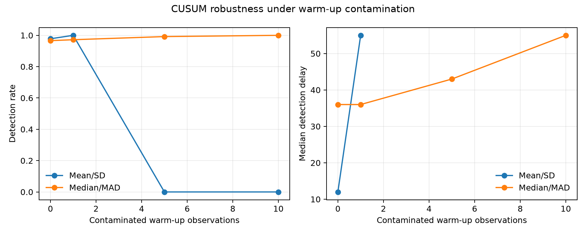

# Evaluating Simple Anomaly Detection Methods on Real-World Time-Series Data

An independent statistics and computing prototype asking: **How do rolling-window length and z-score threshold affect anomaly detection?** SPY, QQQ, and TLT are real-world examples—not trading signals.

## Method in plain language

1. Convert closing prices to daily percentage returns.
2. Summarize the previous 20 or 60 returns with a mean and standard deviation.
3. Calculate `(today's return - past mean) / past standard deviation`.
4. Flag a day when the absolute z-score exceeds 2, 2.5, or 3.
5. On synthetic data, inject known shocks and measure precision, recall, and F1.

The reference statistics are shifted one day, so today's return cannot influence the baseline used to judge today. On real data there is no objective ground truth: flags are observations to investigate, not proven errors.

## Structure

```text
config.json               experiment settings and random seed
src/data.py               download, cleaning, daily returns
src/methods.py            rolling statistics and flags
src/cusum.py              online one-sided CUSUM monitoring
src/synthetic.py          simulation and injected anomalies
src/evaluation.py         precision, recall, F1, experiment grid
scripts/run_analysis.py   complete pipeline
tests/test_core.py        tests of important assumptions
data/ and results/        generated outputs
```

## Reproduce

Requires Python 3.10+.

```bash
python3 -m venv .venv
source .venv/bin/activate
python -m pip install -r requirements.txt
python scripts/run_analysis.py
python -m unittest discover -s tests -v
```

Run only the synthetic experiment without internet: `python scripts/run_analysis.py --skip-download`. The full run extracts adjusted closing prices from a public Yahoo Finance-derived [ETF data snapshot](https://github.com/hhhx-lab/-ETF-/blob/main/docs/data_source_and_preprocessing.md), then caches one CSV per asset. Use `--refresh` to redownload.

## Design

- SPY, QQQ, TLT; 2018-01-01 to 2024-12-31
- Windows: 20 and 60 trading days
- Thresholds: 2.0, 2.5, 3.0
- 1,500 synthetic observations with 30 injected shocks; seed 42

## Limitations

A lower threshold usually improves recall but creates more false positives. A longer window gives a steadier baseline but adapts more slowly. Financial returns are not normally distributed and their variance changes over time, so this z-score is an interpretable baseline, not a final definition of abnormality. Synthetic shocks are known and isolated; real events are ambiguous.

## Main findings

- On real data, raising the threshold from 2.0 to 3.0 reduced the fraction flagged substantially. With a 20-day window, SPY flags fell from 123 (7.1%) to 33 (1.9%). This is sensitivity analysis, not accuracy, because real anomalies have no labels.
- In the synthetic experiment, the 20-day/2.0 setting found 28 of 30 injected shocks (recall 0.933) but produced 82 false positives (precision 0.255).
- The best F1 in this small pre-specified grid was the 60-day/2.5 setting: 27 true positives, 12 false positives, and 3 misses (precision 0.692, recall 0.900, F1 0.783).
- Increasing the 60-day threshold to 3.0 reduced false positives from 12 to 7, but misses increased from 3 to 10. This makes the precision–recall tradeoff concrete.

These conclusions apply to this simulation design and seed; they do not establish that 60/2.5 is universally optimal. `results/tables/synthetic_cases.csv` makes every true positive, false positive, and false negative auditable.

## What I would study next

Repeat the simulation over many random seeds and report mean performance with uncertainty intervals; simulate clusters and gradual level/variance changes; and compare the simple baseline with a robust median/MAD z-score. These are extensions, not claims made by the current prototype.

## Four-day plan

- **Day 1:** structure, ingestion/cleaning, returns, rolling method, configuration, tests.
- **Day 2:** real-data grid, plots, sanity checks, window/threshold interpretation.
- **Day 3:** injected ground truth, precision/recall/F1, false-positive/negative analysis.
- **Day 4:** final visual QA, README findings, tests, GitHub polish, résumé bullets, professor pitch.

This is statistical computing, not a portfolio backtest or investment recommendation.

## Development: online CUSUM change monitoring

The `feature/online-cusum` branch adds a first change-point experiment. It uses
the first 100 absolute returns as a fixed baseline, then processes each later
observation once in chronological order. A one-sided CUSUM accumulates persistent
upward deviations in volatility without using future observations.

```bash
python scripts/run_cusum_demo.py
```

The initial synthetic experiment contains one known volatility increase at index
500. Its threshold comparison reports false alarms and detection delay. This is
an online monitoring prototype; offline segmentation is intentionally left for a
later, separate extension.

### Warm-up contamination experiment

The fixed warm-up design assumes that its first 100 observations describe one
stable state. `scripts/run_baseline_robustness.py` deliberately replaces 0, 1,
5, or 10 warm-up observations with large values over 100 random seeds. It then
compares the change in classical mean/standard-deviation estimates with robust
median/MAD estimates.

```bash
python scripts/run_baseline_robustness.py
```

Median/MAD is intended to resist a minority of isolated extreme values. It does
not prove that the warm-up period contains no regime change, and the two methods'
CUSUM thresholds must be calibrated separately before detection performance can
be compared fairly.

### Calibrated CUSUM experiment

Thresholds were calibrated on 500 no-change simulations, targeting at most a 5%
chance of any false alarm during the 400-observation monitoring period. The
selected settings were threshold 12 for mean/standard deviation (3.4% estimated
false-alarm rate) and threshold 40 for median/MAD (3.8%). Evaluation then used
independent random seeds.

```bash
python scripts/calibrate_cusum_threshold.py
python scripts/evaluate_cusum_shifts.py
python scripts/evaluate_cusum_contamination.py
```

With a clean warm-up, mean/standard deviation detected a 1% to 2% volatility
increase with median delay 11, versus 35 for median/MAD at a matched 4% false-
alarm rate. Robustness changed the conclusion under contamination: replacing 5
of 100 warm-up observations with 10% absolute returns caused mean/standard
deviation to miss all 500 simulated changes, while median/MAD detected 99.2%
with median delay 43. Thus robustness helps under the specific contamination
model, but costs sensitivity when the warm-up data are clean.



This experiment monitors only the first upward volatility change using a fixed
warm-up baseline. It does not yet handle downward shifts, repeated regime
changes, or automatic recalibration after an alarm.
